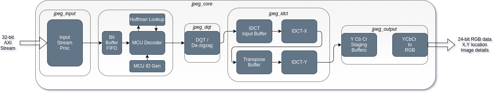
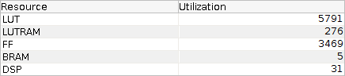
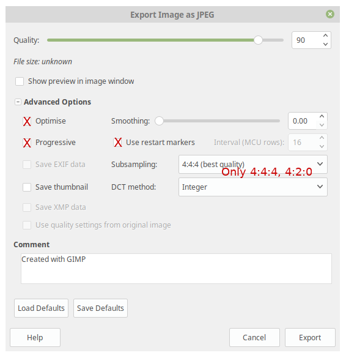

# High throughput JPEG decoder

Github: [https://github.com/ultraembedded/core_jpeg](https://github.com/ultraembedded/core_jpeg)

This project is a JPEG decoder core for FPGA written in Verilog.

## Features
* Baseline JPEG Decoder IP (sequential encoded images).
* 32-bit AXI Stream input.
* Input format: JPEG (JPEG File Interchange Format)
* Output format: 24-bit RGB output in 8x8 blocks (row-major ordering).
* Support for Monochrome, 4:4:4, 4:2:0 chroma subsampling support.
* Support for fixed standard Huffman tables (reduced logic usage, fast).
* Support for dynamic Huffman tables (from JPEG input stream -> slower decode, more logic).
* Dynamic DQT tables from JPEG input stream.
* Synthesizable Verilog 2001, Verilator and FPGA friendly.
* Multipliers and tables / FIFO's map efficiently to FPGA resources (DSP48, blockRAM, etc).
* Verified using co-simulation against a C-model and tested on FPGA with thousands of images.

## Design Aims
1. Fast decode performance suitable for video playback
2. Support a minimal JPEG baseline feature set.
3. Be well tested (with verification against a reference C-model).
4. Map to FPGA resources such as BlockRAM, DSP macros wherever possible.

## FPGA Mapping
The current version of the JPEG decoder uses the following resources on a Xilinx 7 series FPGA (post-implementation);  

The design is also able to meet timing >= 75MHz.

## Performance
Peak JPEG decode performance is as follows;
* Monochrome  = 66 cycles per 8x8 pixels  (1.0 cycles per pixel)
* YCbCr 4:2:0 = 137 cycles per 8x8 pixels (2.1 cycles per pixel)
* YCbCr 4:4:4 = 198 cycles per 8x8 pixels (3.1 cycles per pixel)

## Use Case
The purpose of this design was to replace a 3rd party JPEG decoder core used in my [Motion JPEG](https://en.wikipedia.org/wiki/Motion_JPEG) based [FPGA video player](https://github.com/ultraembedded/FPGAmp).  
Motion JPEG has worse compression performance than MPEG based video, but the complexity of the HW required is low enough that it can be used on low(-ish)-end FPGAs.

Video playback usually requires at least 25 frames per second, hence there is a budget of less than 40ms per JPEG frame.  
This fact drives the design choices taken for this implementation.

Clearly, the higher the resolution, the more pixels that must be produced from the JPEG decoder within that 40ms budget, so this core is designed to have high throughput in the output stages - with additional resources dedicated to the IDCT transform, and output re-ordering stages to facilitate this.

## Limitations
The current release does not support;
* Restart markers
* 4:2:2 H/V chroma subsampling (only 4:4:4 and 4:2:0 are supported).

Under the GNU Image Manipulation Program, the following 'X' options are **not** supported currently;

Note: Support for 'optimised' Huffman tables is possible when design parameter SUPPORT_WRITABLE_DHT=1.  
This functionality increases the core size substantially and reduces performance.

## Future Work / TODO
* Add support for the first layer of progressive JPEG images.
* Add option to reduce arithmetic precision to reduce design size.
* Add lightweight variant of the core with reduced performance (for smaller FPGAs).